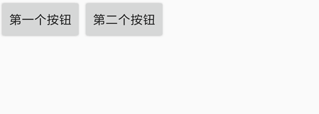
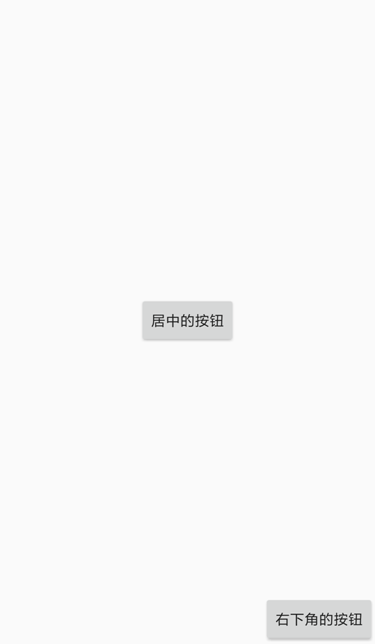
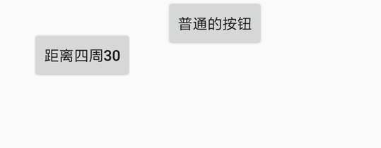
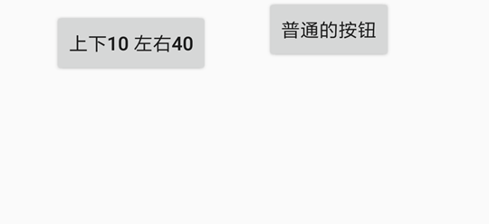
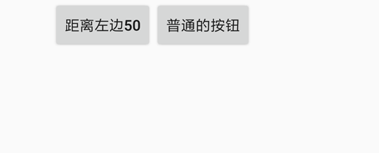

# UI

ui模块提供了编写用户界面的支持。

带有ui的脚本的**第一行**必须使用`"ui"`指定ui模式，否则脚本将不会以ui模式运行。正确示范:

```
"ui";

//脚本的其他代码
```

界面是由视图(View)组成的。View分成两种，控件(Widget)和布局(Layout)。控件(Widget)用来具体显示文字、图片、网页等，比如文本控件(text)用来显示文字，按钮控件(button)则可以显示一个按钮并提供点击效果，图片控件(img)则用来显示来自网络或者文件的图片，除此之外还有输入框控件(input)、进度条控件(progressbar)、单选复选框控件(checkbox)等；布局(Layout)则是装着一个或多个控件的"容器"，用于控制在他里面的控件的位置，比如垂直布局(vertical)会把他里面的控件从上往下依次显示(即纵向排列)，水平布局(horizontal)则会把他里面的控件从左往右依次显示(即横向排列)，以及帧布局(frame)，他会把他里面的控件直接在左上角显示，如果有多个控件，后面的控件会重叠在前面的控件上。

我们使用xml来编写界面，并通过`ui.layout()`函数指定界面的布局xml。举个例子：

```
"ui";
ui.layout(
    <vertical>
        <button text="第一个按钮"/>
        <button text="第二个按钮"/>
    </vertical>
);
```
在这个例子中，第3~6行的部分就是xml，指定了界面的具体内容。代码的第3行的标签`<vertical> ... </vertical>`表示垂直布局，布局的标签通常以`<...>`开始，以`</...>`结束，两个标签之间的内容就是布局里面的内容，例如`<frame> ... </frame>`。在这个例子中第4, 5行的内容就是垂直布局(vertical)里面的内容。代码的第4行是一个按钮控件(button)，控件的标签通常以`<...`开始，以`/>`结束，他们之间是控件的具体属性，例如`<text ... />`。在这个例子中`text="第一个按钮"`的部分就是按钮控件(button)的属性，这个属性指定了这个按钮控件的文本内容(text)为"第一个按钮"。

代码的第5行和第4行一样，也是一个按钮控件，只不过他的文本内容为"第二个按钮"。这两个控件在垂直布局中，因此会纵向排列，效果如图：


如果我们把这个例子的垂直布局(vertical)改成水平布局(horizontal)，也即：

```
"ui";
ui.layout(
    <horizontal>
        <button text="第一个按钮"/>
        <button text="第二个按钮"/>
    </horizontal>
);
```

则这两个按钮会横向排列，效果如图：


一个控件可以指定多个属性(甚至可以不指定任何属性)，用空格隔开即可；布局同样也可以指定属性，例如:

```
"ui";
ui.layout(
    <vertical bg="#ff0000">
        <button text="第一个按钮" textSize="20sp"/>
        <button text="第二个按钮"/>
    </vertical>
);
```

第三行`bg="#ff0000"`指定了垂直布局的背景色(bg)为"#ff0000"，这是一个RGB颜色，表示红色(有关RGB的相关知识参见[RGB颜色对照表](http://tool.oschina.net/commons?type=3))。第四行的`textSize="20sp"`则指定了按钮控件的字体大小(textSize)为"20sp"，sp是一个字体单位，暂时不用深入理会。上述代码的效果如图：


一个界面便由一些布局和控件组成。为了便于文档阅读，我们再说明一下以下术语：
* 子视图, 子控件: 布局里面的控件是这个布局的子控件/子视图。实际上布局里面不仅仅只能有控件，还可以是嵌套的布局。因此用子视图(Child View)更准确一些。在上面的例子中，按钮便是垂直布局的子控件。
* 父视图，父布局：直接包含一个控件的布局是这个控件的父布局/父视图(Parent View)。在上面的例子中，垂直布局便是按钮的父布局。

# 视图: View

控件和布局都属于视图(View)。在这个章节中将介绍所有控件和布局的共有的属性和函数。例如属性背景，宽高等(所有控件和布局都能设置背景和宽高)，函数`click()`设置视图(View)被点击时执行的动作。

## w

View的宽度。可以设置的值为`*`, `auto`和具体数值。其中`*`表示宽度**尽量**填满父布局，而`auto`表示宽度将根据View的内容自动调整(自适应宽度)。例如：
```
"ui";
ui.layout(
    <horizontal>
        <button w="auto" text="自适应宽度"/>
        <button w="*" text="填满父布局"/>
    </horizontal>
);
```
在这个例子中，第一个按钮为自适应宽度，第二个按钮为填满父布局，显示效果为：


如果不设置该属性，则不同的控件和布局有不同的默认宽度，大多数为`auto`。

宽度属性也可以指定一个具体数值。例如`w="20"`，`w="20px"`等。不加单位的情况下默认单位为dp，其他单位包括px(像素), mm(毫米), in(英寸)。有关尺寸单位的更多内容，参见[尺寸的单位: Dimension](#ui_尺寸的单位_Dimension)。

```
"ui";
ui.layout(
    <horizontal>
        <button w="200" text="宽度200dp"/>
        <button w="100" text="宽度100dp"/>
    </horizontal>
);
```

## h

View的高度。可以设置的值为`*`, `auto`和具体数值。其中`*`表示宽度**尽量**填满父布局，而`auto`表示宽度将根据View的内容自动调整(自适应宽度)。

如果不设置该属性，则不同的控件和布局有不同的默认高度，大多数为`auto`。

宽度属性也可以指定一个具体数值。例如`h="20"`，`h="20px"`等。不加单位的情况下默认单位为dp，其他单位包括px(像素), mm(毫米), in(英寸)。有关尺寸单位的更多内容，参见[尺寸的单位: Dimension](#ui_尺寸的单位_Dimension)。

## id

View的id，用来区分一个界面下的不同控件和布局，一个界面的id在同一个界面下通常是唯一的，也就是一般不存在两个View有相同的id。id属性也是连接xml布局和JavaScript代码的桥梁，在代码中可以通过一个View的id来获取到这个View，并对他进行操作(设置点击动作、设置属性、获取属性等)。例如：
```
"ui";
ui.layout(
    <frame>
        <button id="ok" text="确定"/>
    </frame>
);
//通过ui.ok获取到按钮控件
toast(ui.ok.getText());
```

这个例子中有一个按钮控件"确定"，id属性为"ok"，那么我们可以在代码中使用`ui.ok`来获取他，再通过`getText()`函数获取到这个按钮控件的文本内容。
另外这个例子中使用帧布局(frame)是因为，我们只有一个控件，因此用于最简单的布局帧布局。

## gravity

View的"重力"。用于决定View的内容相对于View的位置，可以设置的值为:
* `left` 靠左
* `right` 靠右
* `top` 靠顶部
* `bottom` 靠底部
* `center` 居中
* `center_vertical` 垂直居中
* `center_horizontal` 水平居中

例如对于一个按钮控件，`gravity="right"`会使其中的文本内容靠右显示。例如：

```
"ui";
ui.layout(
    <frame>
        <button w="*" text="靠右的文字"/>
    </frame>
);
```
显示效果为:


这些属性是可以组合的，例如`gravity="right|bottom"`的View他的内容会在右下角。

## layout_gravity

View在布局中的"重力"，用于决定View本身在他的**父布局**的位置，可以设置的值和gravity属性相同。注意把这个属性和gravity属性区分开来。

```
"ui";
ui.layout(
    <frame w="*" h="*">
        <button layout_gravity="center" text="居中的按钮"/>
        <button layout_gravity="center" text="居中的按钮"/>
    </frame>
);
```

在这个例子中，我们让帧布局(frame)的大小占满整个屏幕，通过给第一个按钮设置属性`layout_gravity="center"`来使得按钮在帧布局中居中，通过给第二个按钮设置属性`gravity="right|bottom"`使得他在帧布局中位于右下角。效果如图：


要注意的是，layout_gravity的属性不一定总是生效的，具体取决于布局的类别。例如不能让水平布局中的第一个子控件靠底部显示(否则和水平布局本身相违背)。
## margin

margin为View和其他View的间距，即外边距。margin属性包括四个值:
* `marginLeft` 左外边距
* `marginRight` 右外边距
* `marginTop` 上外边距
* `marginBottom` 下外边距

而margin属性本身的值可以有三种格式:
* `margin="marginAll"` 指定各个外边距都是该值。例如`margin="10"`表示左右上下边距都是10dp。
* `margin="marginLeft marginTop marginRight marginBottom"` 分别指定各个外边距。例如`margin="10 20 30 40"`表示左边距为10dp, 上边距为20dp, 右边距为30dp, 下边距为40dp
* `margin="marginHorizontal marginVertical"` 指定水平外边距和垂直外边距。例如`margin="10 20"`表示左右边距为10dp, 上下边距为20dp。

用一个例子来具体理解外边距的含义：
```
"ui";
ui.layout(
    <horizontal>
        <button margin="30" text="宽度200dp"/>
        <button text="宽度100dp"/>
    </horizontal>
);
```
第一个按钮的margin属性指定了他的边距为30dp, 也就是他与水平布局以及第二个按钮的间距都是30dp, 其显示效果如图:


如果把`margin="30"`改成`margin="10 40"`那么第一个按钮的左右间距为10dp, 上下间距为40dp, 效果如图:


有关margin属性的单位，参见[尺寸的单位: Dimension](#ui_尺寸的单位_Dimension)。

## marginLeft

View的左外边距。如果该属性和margin属性指定的值冲突，则在后面的属性生效，前面的属性无效，例如`margin="20" marginLeft="10"`的左外边距为10dp，其他外边距为20dp。

```
"ui";
ui.layout(
    <horizontal>
        <button marginLeft="50" text="宽度200dp"/>
        <button text="宽度100dp"/>
    </horizontal>
);
```

第一个按钮指定了左外边距为50dp，则他和他的父布局水平布局(horizontal)的左边的间距为50dp, 效果如图：


## marginRight

View的右外边距。如果该属性和margin属性指定的值冲突，则在后面的属性生效，前面的属性无效。

## marginTop

View的上外边距。如果该属性和margin属性指定的值冲突，则在后面的属性生效，前面的属性无效。

## marginBottom

View的下外边距。如果该属性和margin属性指定的值冲突，则在后面的属性生效，前面的属性无效。

## padding

View和他的自身内容的间距，也就是内边距。注意和margin属性区分开来，margin属性是View之间的间距，而padding是View和他自身内容的间距。举个例子，一个文本控件的padding也即文本控件的边缘和他的文本内容的间距，paddingLeft即文本控件的左边和他的文本内容的间距。

paddding属性的值同样有三种格式：

* `padding="paddingAll"` 指定各个内边距都是该值。例如`padding="10"`表示左右上下内边距都是10dp。
* `padding="paddingLeft paddingTop paddingRight paddingBottom"` 分别指定各个内边距。例如`padding="10 20 30 40"`表示左内边距为10dp, 上内边距为20dp, 右内边距为30dp, 下内边距为40dp
* `padding="paddingHorizontal paddingVertical"` 指定水平内边距和垂直内边距。例如`padding="10 20"`表示左右内边距为10dp, 上下内边距为20dp。

用一个例子来具体理解内边距的含义：

```
"ui";
ui.layout(
    <frame w="*" h="*" gravity="center">
        <text padding="10 20 30 40" bg="#ff0000" text="HelloWorld"/>
    </frame>
);
```

这个例子是一个居中的按钮(通过父布局的`gravity="center"`属性设置)，背景色为红色(`bg="#ff0000"`)，文本内容为"HelloWorld"，左边距为10dp，上边距为20dp，下边距为30dp，右边距为40dp，其显示效果如图：


## paddingLeft

View的左内边距。如果该属性和padding属性指定的值冲突，则在后面的属性生效，前面的属性无效。

## paddingRight

View的右内边距。如果该属性和padding属性指定的值冲突，则在后面的属性生效，前面的属性无效。

## paddingTop

View的上内边距。如果该属性和padding属性指定的值冲突，则在后面的属性生效，前面的属性无效。

## paddingBottom

View的下内边距。如果该属性和padding属性指定的值冲突，则在后面的属性生效，前面的属性无效。

## bg

View的背景。其值可以是一个链接或路径指向的图片，或者RGB格式的颜色，或者其他背景。具体参见[Drawables](#draw)。

例如，`bg="#00ff00"`设置背景为绿色，`bg="file:///sdcard/1.png"`设置背景为图片"1.png"，`bg="?attr/selectableItemBackground"`设置背景为点击时出现的波纹效果(可能需要同时设置`clickable="true"`才生效)。

## alpha

View的透明度，其值是一个0~1之间的小数，0表示完全透明，1表示完全不透明。例如`alpha="0.5"`表示半透明。

## foreground

View的前景。前景即在一个View的内容上显示的内容，可能会覆盖掉View本身的内容。其值和属性bg的值类似。

## minHeight

View的最小高度。

## minWidth

View的最小宽度。

## rotation


## visbility

View的可见性。其值可以为：
* `gone` 不可见。
* `visible` 可见。默认情况下View都是可见的。
* `invisible` 不可见，但仍然占用位置。