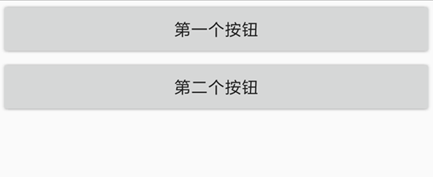
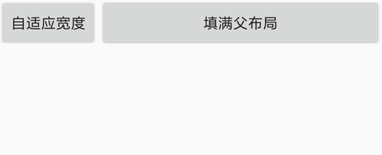
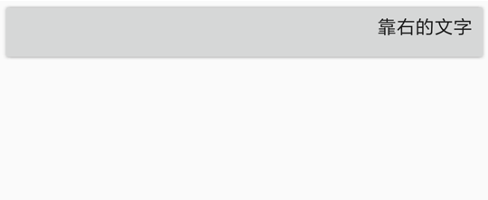
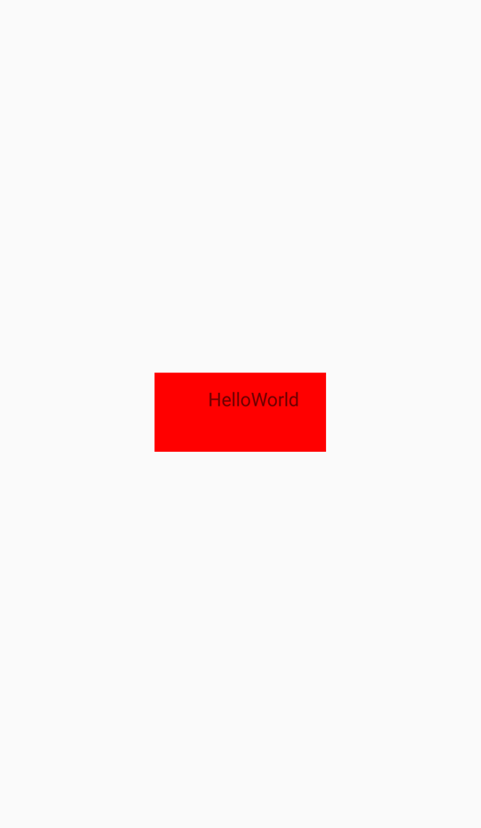

# 用户界面: UI

ui模块提供了编写用户界面的支持。

带有ui的脚本的**第一行**必须使用`"ui"`指定ui模式，否则脚本将不会以ui模式运行。正确示范:

```
"ui";

//脚本的其他代码
```

界面是由视图(View)组成的。View分成两种，控件(Widget)和布局(Layout)。控件(Widget)用来具体显示文字、图片、网页等，比如文本控件(text)用来显示文字，按钮控件(button)则可以显示一个按钮并提供点击效果，图片控件(img)则用来显示来自网络或者文件的图片，除此之外还有输入框控件(input)、进度条控件(progressbar)、单选复选框控件(checkbox)等；布局(Layout)则是装着一个或多个控件的"容器"，用于控制在他里面的控件的位置，比如垂直布局(vertical)会把他里面的控件从上往下依次显示(即纵向排列)，水平布局(horizontal)则会把他里面的控件从左往右依次显示(即横向排列)，以及帧布局(frame)，他会把他里面的控件直接在左上角显示，如果有多个控件，后面的控件会重叠在前面的控件上。

我们使用xml来编写界面，并通过`ui.layout()`函数指定界面的布局xml。举个例子：

```
"ui";
ui.layout(
    <vertical>
        <button text="第一个按钮"/>
        <button text="第二个按钮"/>
    </vertical>
);
```
在这个例子中，第3~6行的部分就是xml，指定了界面的具体内容。代码的第3行的标签`<vertical> ... </vertical>`表示垂直布局，布局的标签通常以`<...>`开始，以`</...>`结束，两个标签之间的内容就是布局里面的内容，例如`<frame> ... </frame>`。在这个例子中第4, 5行的内容就是垂直布局(vertical)里面的内容。代码的第4行是一个按钮控件(button)，控件的标签通常以`<...`开始，以`/>`结束，他们之间是控件的具体属性，例如`<text ... />`。在这个例子中`text="第一个按钮"`的部分就是按钮控件(button)的属性，这个属性指定了这个按钮控件的文本内容(text)为"第一个按钮"。

代码的第5行和第4行一样，也是一个按钮控件，只不过他的文本内容为"第二个按钮"。这两个控件在垂直布局中，因此会纵向排列，效果如图：



如果我们把这个例子的垂直布局(vertical)改成水平布局(horizontal)，也即：

```
"ui";
ui.layout(
    <horizontal>
        <button text="第一个按钮"/>
        <button text="第二个按钮"/>
    </horizontal>
);
```

则这两个按钮会横向排列，效果如图：


一个控件可以指定多个属性(甚至可以不指定任何属性)，用空格隔开即可；布局同样也可以指定属性，例如:

```
"ui";
ui.layout(
    <vertical bg="#ff0000">
        <button text="第一个按钮" textSize="20sp"/>
        <button text="第二个按钮"/>
    </vertical>
);
```

第三行`bg="#ff0000"`指定了垂直布局的背景色(bg)为"#ff0000"，这是一个RGB颜色，表示红色(有关RGB的相关知识参见[RGB颜色对照表](http://tool.oschina.net/commons?type=3))。第四行的`textSize="20sp"`则指定了按钮控件的字体大小(textSize)为"20sp"，sp是一个字体单位，暂时不用深入理会。上述代码的效果如图：


一个界面便由一些布局和控件组成。为了便于文档阅读，我们再说明一下以下术语：
* 子视图, 子控件: 布局里面的控件是这个布局的子控件/子视图。实际上布局里面不仅仅只能有控件，还可以是嵌套的布局。因此用子视图(Child View)更准确一些。在上面的例子中，按钮便是垂直布局的子控件。
* 父视图，父布局：直接包含一个控件的布局是这个控件的父布局/父视图(Parent View)。在上面的例子中，垂直布局便是按钮的父布局。

# 视图: View

控件和布局都属于视图(View)。在这个章节中将介绍所有控件和布局的共有的属性和函数。例如属性背景，宽高等(所有控件和布局都能设置背景和宽高)，函数`click()`设置视图(View)被点击时执行的动作。

## w

View的宽度，是属性`width`的缩写形式。可以设置的值为`*`, `auto`和具体数值。其中`*`表示宽度**尽量**填满父布局，而`auto`表示宽度将根据View的内容自动调整(自适应宽度)。例如：
```
"ui";
ui.layout(
    <horizontal>
        <button w="auto" text="自适应宽度"/>
        <button w="*" text="填满父布局"/>
    </horizontal>
);
```
在这个例子中，第一个按钮为自适应宽度，第二个按钮为填满父布局，显示效果为：



如果不设置该属性，则不同的控件和布局有不同的默认宽度，大多数为`auto`。

宽度属性也可以指定一个具体数值。例如`w="20"`，`w="20px"`等。不加单位的情况下默认单位为dp，其他单位包括px(像素), mm(毫米), in(英寸)。有关尺寸单位的更多内容，参见[尺寸的单位: Dimension](#ui_尺寸的单位_Dimension)。

```
"ui";
ui.layout(
    <horizontal>
        <button w="200" text="宽度200dp"/>
        <button w="100" text="宽度100dp"/>
    </horizontal>
);
```

## h

View的高度，是属性`height`的缩写形式。可以设置的值为`*`, `auto`和具体数值。其中`*`表示宽度**尽量**填满父布局，而`auto`表示宽度将根据View的内容自动调整(自适应宽度)。

如果不设置该属性，则不同的控件和布局有不同的默认高度，大多数为`auto`。

宽度属性也可以指定一个具体数值。例如`h="20"`，`h="20px"`等。不加单位的情况下默认单位为dp，其他单位包括px(像素), mm(毫米), in(英寸)。有关尺寸单位的更多内容，参见[尺寸的单位: Dimension](#ui_尺寸的单位_Dimension)。

## id

View的id，用来区分一个界面下的不同控件和布局，一个界面的id在同一个界面下通常是唯一的，也就是一般不存在两个View有相同的id。id属性也是连接xml布局和JavaScript代码的桥梁，在代码中可以通过一个View的id来获取到这个View，并对他进行操作(设置点击动作、设置属性、获取属性等)。例如：
```
"ui";
ui.layout(
    <frame>
        <button id="ok" text="确定"/>
    </frame>
);
//通过ui.ok获取到按钮控件
toast(ui.ok.getText());
```

这个例子中有一个按钮控件"确定"，id属性为"ok"，那么我们可以在代码中使用`ui.ok`来获取他，再通过`getText()`函数获取到这个按钮控件的文本内容。
另外这个例子中使用帧布局(frame)是因为，我们只有一个控件，因此用于最简单的布局帧布局。

## gravity

View的"重力"。用于决定View的内容相对于View的位置，可以设置的值为:
* `left` 靠左
* `right` 靠右
* `top` 靠顶部
* `bottom` 靠底部
* `center` 居中
* `center_vertical` 垂直居中
* `center_horizontal` 水平居中

例如对于一个按钮控件，`gravity="right"`会使其中的文本内容靠右显示。例如：

```
"ui";
ui.layout(
    <frame>
        <button gravity="right" w="*" h="auto" text="靠右的文字"/>
    </frame>
);
```
显示效果为:



这些属性是可以组合的，例如`gravity="right|bottom"`的View他的内容会在右下角。

## layout_gravity

View在布局中的"重力"，用于决定View本身在他的**父布局**的位置，可以设置的值和gravity属性相同。注意把这个属性和gravity属性区分开来。

```
"ui";
ui.layout(
    <frame w="*" h="*">
        <button layout_gravity="center" w="auto" h="auto" text="居中的按钮"/>
        <button layout_gravity="right|bottom" w="auto" h="auto" text="右下角的按钮"/>
    </frame>
);
```

在这个例子中，我们让帧布局(frame)的大小占满整个屏幕，通过给第一个按钮设置属性`layout_gravity="center"`来使得按钮在帧布局中居中，通过给第二个按钮设置属性`layout_gravity="right|bottom"`使得他在帧布局中位于右下角。效果如图：


要注意的是，layout_gravity的属性不一定总是生效的，具体取决于布局的类别。例如不能让水平布局中的第一个子控件靠底部显示(否则和水平布局本身相违背)。
## margin

margin为View和其他View的间距，即外边距。margin属性包括四个值:
* `marginLeft` 左外边距
* `marginRight` 右外边距
* `marginTop` 上外边距
* `marginBottom` 下外边距

而margin属性本身的值可以有三种格式:
* `margin="marginAll"` 指定各个外边距都是该值。例如`margin="10"`表示左右上下边距都是10dp。
* `margin="marginLeft marginTop marginRight marginBottom"` 分别指定各个外边距。例如`margin="10 20 30 40"`表示左边距为10dp, 上边距为20dp, 右边距为30dp, 下边距为40dp
* `margin="marginHorizontal marginVertical"` 指定水平外边距和垂直外边距。例如`margin="10 20"`表示左右边距为10dp, 上下边距为20dp。

用一个例子来具体理解外边距的含义：
```
"ui";
ui.layout(
    <horizontal>
        <button margin="30" text="距离四周30"/>
        <button text="普通的按钮"/>
    </horizontal>
);
```
第一个按钮的margin属性指定了他的边距为30dp, 也就是他与水平布局以及第二个按钮的间距都是30dp, 其显示效果如图:


如果把`margin="30"`改成`margin="10 40"`那么第一个按钮的左右间距为10dp, 上下间距为40dp, 效果如图:


有关margin属性的单位，参见[尺寸的单位: Dimension](#ui_尺寸的单位_Dimension)。

## marginLeft

View的左外边距。如果该属性和margin属性指定的值冲突，则在后面的属性生效，前面的属性无效，例如`margin="20" marginLeft="10"`的左外边距为10dp，其他外边距为20dp。

```
"ui";
ui.layout(
    <horizontal>
        <button marginLeft="50" text="距离左边50"/>
        <button text="普通的按钮"/>
    </horizontal>
);
```

第一个按钮指定了左外边距为50dp，则他和他的父布局水平布局(horizontal)的左边的间距为50dp, 效果如图：


## marginRight

View的右外边距。如果该属性和margin属性指定的值冲突，则在后面的属性生效，前面的属性无效。

## marginTop

View的上外边距。如果该属性和margin属性指定的值冲突，则在后面的属性生效，前面的属性无效。

## marginBottom

View的下外边距。如果该属性和margin属性指定的值冲突，则在后面的属性生效，前面的属性无效。

## padding

View和他的自身内容的间距，也就是内边距。注意和margin属性区分开来，margin属性是View之间的间距，而padding是View和他自身内容的间距。举个例子，一个文本控件的padding也即文本控件的边缘和他的文本内容的间距，paddingLeft即文本控件的左边和他的文本内容的间距。

paddding属性的值同样有三种格式：

* `padding="paddingAll"` 指定各个内边距都是该值。例如`padding="10"`表示左右上下内边距都是10dp。
* `padding="paddingLeft paddingTop paddingRight paddingBottom"` 分别指定各个内边距。例如`padding="10 20 30 40"`表示左内边距为10dp, 上内边距为20dp, 右内边距为30dp, 下内边距为40dp
* `padding="paddingHorizontal paddingVertical"` 指定水平内边距和垂直内边距。例如`padding="10 20"`表示左右内边距为10dp, 上下内边距为20dp。

用一个例子来具体理解内边距的含义：

```
"ui";
ui.layout(
    <frame w="*" h="*" gravity="center">
        <text padding="10 20 30 40" bg="#ff0000" w="auto" h="auto" text="HelloWorld"/>
    </frame>
);
```

这个例子是一个居中的按钮(通过父布局的`gravity="center"`属性设置)，背景色为红色(`bg="#ff0000"`)，文本内容为"HelloWorld"，左边距为10dp，上边距为20dp，下边距为30dp，右边距为40dp，其显示效果如图：



## paddingLeft

View的左内边距。如果该属性和padding属性指定的值冲突，则在后面的属性生效，前面的属性无效。

## paddingRight

View的右内边距。如果该属性和padding属性指定的值冲突，则在后面的属性生效，前面的属性无效。

## paddingTop

View的上内边距。如果该属性和padding属性指定的值冲突，则在后面的属性生效，前面的属性无效。

## paddingBottom

View的下内边距。如果该属性和padding属性指定的值冲突，则在后面的属性生效，前面的属性无效。

## bg

View的背景。其值可以是一个链接或路径指向的图片，或者RGB格式的颜色，或者其他背景。具体参见[Drawables](#draw)。

例如，`bg="#00ff00"`设置背景为绿色，`bg="file:///sdcard/1.png"`设置背景为图片"1.png"，`bg="?attr/selectableItemBackground"`设置背景为点击时出现的波纹效果(可能需要同时设置`clickable="true"`才生效)。

## alpha

View的透明度，其值是一个0~1之间的小数，0表示完全透明，1表示完全不透明。例如`alpha="0.5"`表示半透明。

## foreground

View的前景。前景即在一个View的内容上显示的内容，可能会覆盖掉View本身的内容。其值和属性bg的值类似。

## minHeight

View的最小高度。该值不总是生效的，取决于其父布局是否有足够的空间容纳。

例：`<text height="auto" minHeight="50"/>`

有关该属性的单位，参见[尺寸的单位: Dimension](#ui_尺寸的单位_Dimension)。

## minWidth

View的最小宽度。该值不总是生效的，取决于其父布局是否有足够的空间容纳。

例：`<input width="auto" minWidth="50"/>`

有关该属性的单位，参见[尺寸的单位: Dimension](#ui_尺寸的单位_Dimension)。

## visbility

View的可见性，该属性可以决定View是否显示出来。其值可以为：
* `gone` 不可见。
* `visible` 可见。默认情况下View都是可见的。
* `invisible` 不可见，但仍然占用位置。

## rotation

View的旋转角度。通过该属性可以让这个View顺时针旋转一定的角度。例如`rotation="90"`可以让他顺时针旋转90度。

如果要设置旋转中心，可以通过`transformPivotX`, `transformPivotY`属性设置。默认的旋转中心为View的中心。

## transformPivotX

View的变换中心坐标x。用于View的旋转、放缩等变换的中心坐标。例如`transformPivotX="10"`。

该坐标的坐标系以View的左上角为原点。也就是x值为变换中心到View的左边的距离。

有关该属性的单位，参见[尺寸的单位: Dimension](#ui_尺寸的单位_Dimension)。

## transformPivotY

View的变换中心坐标y。用于View的旋转、放缩等变换的中心坐标。例如`transformPivotY="10"`。

该坐标的坐标系以View的左上角为原点。也就是y值为变换中心到View的上边的距离。

有关该属性的单位，参见[尺寸的单位: Dimension](#ui_尺寸的单位_Dimension)。

## style

设置View的样式。不同控件有不同的可选的内置样式。具体参见各个控件的说明。

需要注意的是，style属性只支持安卓5.1及其以上。

# 文本控件: text

文本控件用于显示文本，可以控制文本的字体大小，字体颜色，字体等。

以下介绍该控件的主要属性和方法，如果要查看他的所有属性和方法，请阅读[TextView](http://www.zhdoc.net/android/reference/android/widget/TextView.html)。

## text 

设置文本的内容。例如`text="一段文本"`。

## textColor

设置字体的颜色，可以是RGB格式的颜色(例如#ff00ff)，或者颜色名称(例如red, green等)，具体参见[颜色](#ui_颜色)。

示例, 红色字体：`<text text="红色字体" textColor="red"/>`

## textSize

设置字体的大小，单位一般是sp。按照Material Design的规范，正文字体大小为14sp，标题字体大小为18sp，次标题为16sp。

示例，超大字体: `<text text="超大字体" textSize="40sp"/>`

## textStyle

设置字体的样式，比如斜体、粗体等。可选的值为：
* bold  加粗字体
* italic  斜体	
* normal  正常字体

可以用或("|")把他们组合起来，比如粗斜体为"bold|italic"。

例如，粗体：`<text textStyle="bold" textSize="18sp" text="这是粗体"/>

## lines

设置文本控件的行数。即使文本内容没有达到设置的行数，控件也会留出相应的宽度来显示空白行；如果文本内容超出了设置的行数，则超出的部分不会显示。

另外在xml中是不能设置多行文本的，要在代码中设置。例如:

```
"ui";
ui.layout(
    <vertical>
        <text id="myText" line="3">
    </vertical>
)
//通过\n换行
ui.myText.setText("第一行\n第二行\n第三行\n第四行");
```

## maxLines

设置文本控件的最大行数。

## typeface

设置字体。可选的值为：
* `normal` 正常字体
* `sans` 衬线字体
* `serif` 非衬线字体
* `monospace` 等宽字体

示例，等宽字体: `<text text="等宽字体" typeface="monospace"/>`

## ellipsize

设置文本的省略号位置。文本的省略号会在文本内容超出文本控件时显示。可选的值为：
* `end`   在文本末尾显示省略号
* `marquee`   跑马灯效果，文本将滚动显示
* `middle`	在文本中间显示省略号
* `none`	不显示省略号
* `start`	在文本开头显示省略号

## ems

当设置该属性后,TextView显示的字符长度（单位是em）,超出的部分将不显示，或者根据ellipsize属性的设置显示省略号。

例如，限制文本最长为5em: `<text ems="5" ellipsize="end" text="很长很长很长很长很长很长很长的文本"/>

## autoLink

控制是否自动找到url和电子邮件地址等链接，并转换为可点击的链接。默认值为“none”。

设置该值可以让文本中的链接、电话等变成可点击状态。

可选的值为以下的值以其通过或("|")的组合：

* `all`    匹配所有连接、邮件、地址、电话
* `email`    匹配电子邮件地址
* `map`    匹配地图地址
* `none`    不匹配 (默认)
* `phone`    匹配电话号码
* `web`    匹配URL地址

示例：`<text autoLink="web|phone" text="百度: http://www.baidu.com 电信电话: 10000"/>`

# 按钮控件: button

按钮控件是一个特殊的文本控件，因此所有文本控件的函数的属性都适用于按钮控件。

除此之外，按钮控件有一些内置的样式，通过`style`属性设置，包括：
* Widget.AppCompat.Button.Colored 带颜色的按钮
* Widget.AppCompat.Button.Borderless 无边框按钮
* Widget.AppCompat.Button.Borderless.Colored 带颜色的无边框按钮

这些样式的具体效果参见"示例/界面控件/按钮控件.js"。

例如：`<button style="Widget.AppCompat.Button.Colored" text="漂亮的按钮"/>`

# 输入框控件: input

输入框控件也是一个特殊的文本控件，因此所有文本控件的函数的属性都适用于按钮控件。

对于一个输入框控件，我们可以通过text属性设置他的内容，通过lines属性指定输入框的行数；在代码中通过`getText()`函数获取输入的内容。例如：
```
"ui";
ui.layout(
    <vertical padding="16">
        <text textSize="16sp" textColor="black" text="请输入姓名"/>
        <input id="name" text="小明"/>
        <button id="ok" text="确定"/>
    </vertical>
);
//指定确定按钮点击时要执行的动作
ui.ok.click(function(){
    //通过getText()获取输入的内容
    var name = ui.name.getText();
    toast(name + "您好!");
});
```

效果如图：


除此之外，输入框控件有另外一些主要属性(虽然这些属性对于文本控件也是可用的但一般只用于输入框控件)：

## hint

输入提示。这个提示会在输入框为空的时候显示出来。如图所示:


上面图片效果的代码为：
```
"ui";
ui.layout(
    <vertical>
        <input hint="请输入姓名"/>
    </vertical>
)
```

## textColorHint

指定输入提示的字体颜色。

## textSizeHint

指定输入提示的字体大小。

## inputType

指定输入框可以输入的文本类型。可选的值为以下值及其用"|"的组合:
* `date`    用于输入日期。
* `datetime`    用于输入日期和时间。
* `none`    没有内容类型。此输入框不可编辑。
* `number`    仅可输入数字。
* `numberDecimal`    可以与number和它的其他选项组合，以允许输入十进制数(包括小数)。
* `numberPassword`    仅可输入数字密码。
* `numberSigned`    可以与number和它的其他选项组合，以允许输入有符号的数。
* `phone`    用于输入一个电话号码。
* `text`    只是普通文本。
* `textAutoComplete`    可以与text和它的其他选项结合, 以指定此字段将做自己的自动完成, 并适当地与输入法交互。
* `textAutoCorrect`    可以与text和它的其他选项结合, 以请求自动文本输入纠错。
* `textCapCharacters`    可以与text和它的其他选项结合, 以请求大写所有字符。
* `textCapSentences`    可以与text和它的其他选项结合, 以请求大写每个句子里面的第一个字符。
* `textCapWords`    可以与text和它的其他选项结合, 以请求大写每个单词里面的第一个字符。
* `textEmailAddress`    用于输入一个电子邮件地址。
* `textEmailSubject`    用于输入电子邮件的主题。
* `textImeMultiLine`    可以与text和它的其他选项结合，以指示虽然常规文本视图不应为多行, 但如果可以, 则IME应提供多行支持。
* `textLongMessage`    用于输入长消息的内容。
* `textMultiLine`    可以与text和它的其他选项结合, 以便在该字段中允许多行文本。如果未设置此标志, 则文本字段将被限制为单行。
* `textNoSuggestions`    可以与text及它的其他选项结合, 以指示输入法不应显示任何基于字典的单词建议。
* `textPassword`    用于输入密码。
* `textPersonName`    用于输入人名。
* `textPhonetic`    用于输入拼音发音的文本, 如联系人条目中的拼音名称字段。
* `textPostalAddress`    用于输入邮寄地址。
* `textShortMessage`    用于输入短的消息内容。
* `textUri`    用于输入一个URI。
* `textVisiblePassword`    用于输入可见的密码。
* `textWebEditText`    用于输入在web表单中的文本。
* `textWebEmailAddress`    用于在web表单里输入一个电子邮件地址。
* `textWebPassword`    用于在web表单里输入一个密码。
* `time`    用于输入时间。

例如，想指定一个输入框的输入类型为小数数字，为: `<input inputType="number|numberDecimal"/>`

## password

指定输入框输入框是否为密码输入框。默认为`false`。

例如：`<input password="true"/>`

## numeric

指定输入框输入框是否为数字输入框。默认为`false`。

例如：`<input numeric="true"/>`

## phoneNumber

指定输入框输入框是否为电话号码输入框。默认为`false`。

例如：`<input phoneNumber="true"/>`

## digits

指定输入框可以输入的字符。例如，要指定输入框只能输入"1234567890+-"，为`<input digits="1234567890+-"/>`。

## singleLine

指定输入框是否为单行输入框。默认为`false`。您也可以通过`lines="1"`来指定单行输入框。

例如：`<input singleLine="true"/>`

# 图片控件: img

# 线性布局: linear

# 垂直布局: vertical

# 水平布局: horizontal

# 帧布局: frame

# 相对布局: relative

# 勾选框控件: checkbox

# 选择框控件: radio

# 选择框布局: radiogroup

# 开关控件: switch

# 进度条控件: progressbar

# 拖动条控件: seekbar

# 下来菜单控件: spinner

# 时间选择控件: timepicker

# 日期选择控件: datepicker

# 浮动按钮控件: fab

# 标题栏控件: toolbar

# 卡片: card

# 抽屉布局: drawer

# 列表: list

# Tab: tab 

# ui

## ui.layout(xml)

## ui.inflate(xml[, parent])

## ui.findView(id)

## ui.finish()

## ui.setContentView(view)

## ui.run(callback)

## ui.post(callback[, daley])

## ui.statusBarColor(color)

## ui.showPopupMenu(view, menu)

# 尺寸的单位: Dimension

# Drawables

# 颜色

**(完善中...)**